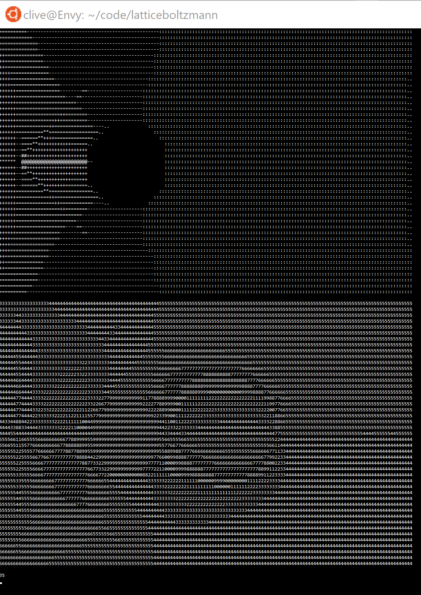

Lattice Boltzmann Method
========================

YouTube videos:

Older version screenshot (top is density, bottom is direction field):

## Requirements

My setup:
- AMD Ryzen 3700x
- Nvidia GeForce RTX 2070 with drivers 440.59 and CUDA 10.2
- Ubuntu 18.04
- Python 3.7.4 using conda
I suspect but cannot test that this will work with much earlier versions / lower specs.

Install pycuda from source with `./configure.py --cuda-enable-gl`

## Benchmarking

`hyperfine` is nice, from github.com/sharkdp/hyperfine.

### Python profiling:
Run `python -m cProfile -s cumtime latticeboltzmann.py | less` for perhaps a minute.

### Nvidia profiling:
First allow NV usage: `echo 'options nvidia "NVreg_RestrictProfilingToAdminUsers=0"' | sudo tee /etc/modprobe.d/nsight-privilege.conf` and reboot.

Then run `nv-nsight-cu-cli --target-processes all python latticeboltzmann.py`. A few seconds of samples will do.

`nvvp` is also nice, but you need to `sudo apt install openjdk-8-jdk` then `nvvp -vm /usr/lib/jvm/java-8-openjdk-amd64/jre/bin/java`.

## Etc

I promise I'll write more stuff here about what I learned about fluid dynamics simulation when it's not 3AM.

References:
- http://physics.weber.edu/schroeder/javacourse/LatticeBoltzmann.pdf (main one)
- https://pdfs.semanticscholar.org/847f/819a4ea14bd789aca8bc88e85e906cfc657c.pdf
- https://mikeash.com/pyblog/fluid-simulation-for-dummies.html (this is a great intro)

Stuff I've done beyond these:
- Implemented in python
- Very well vectorized though tbh could be better
- Thermalized initialization

Issues:
- Still haven't been able to replicate vortex shedding; I don't know whether it's actually a code bug or I just am not hitting the right Reynolds numbers.
- Direction field also looks wrong at first glance. I probably need better visualization as a first step.

Perftesting
- Use cProfile directly
  - `python -m cProfile -s tottime latticeboltzmann.py`
- or use kcachegrind with it
  - `python -m cProfile -s tottime -o profile_data.pyprof latticeboltzmann.py`
  - `pyprof2calltree -i profile_data.pyprof -k`

Future directions:
- Javascript in-browser implementation using compute APIs
- Cython implementation
- CUDA implementation using pycuda
- Julia implementation
  - With CUDANative.jl
  - With distributability
- PyTorch implementation (cf https://github.com/kobejean/tf-cfd?)
  - Failed, pytorch has a 3-4x slowdown :/

